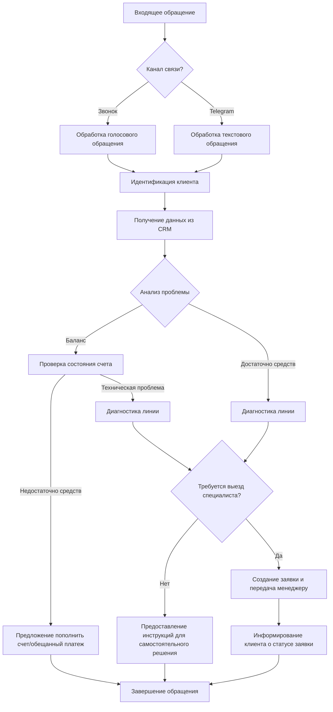

# Детальное описание проекта и бизнес-процессов

## 1. Общая информация о проекте

- **Полное название проекта**: Нейро-техническая поддержка для компании Гиганет
- **Краткое описание**: Интеллектуальная система технической поддержки с использованием технологий ИИ, интегрированная с CRM компании Гиганет для обработки обращений клиентов через различные каналы связи.
- **История возникновения потребности**: Высокая нагрузка на существующую службу поддержки (до 250-300 звонков при авариях), необходимость оптимизации работы технической поддержки и улучшения клиентского сервиса.
- **Общее описание решения**: Автоматизированная система обработки обращений клиентов с использованием технологий ИИ, способная идентифицировать клиентов, получать информацию из CRM, определять тип проблемы и предлагать решения или создавать заявки.
- **Место проекта в экосистеме компании**: Критически важный компонент клиентского сервиса, связующее звено между клиентами и техническими специалистами компании.
- **Стратегическая важность**: Повышение эффективности работы технической поддержки, сокращение времени ожидания клиентов, улучшение клиентского опыта, оптимизация нагрузки на операторов.

## 2. Бизнес-цели и задачи

- **Основные бизнес-цели**:
  - Сокращение времени ожидания клиентов при обращении в техническую поддержку
  - Уменьшение количества пропущенных обращений, особенно в периоды пиковой нагрузки
  - Автоматизация рутинных задач для операторов технической поддержки
  - Улучшение качества клиентского сервиса
  - Создание дополнительного канала для продажи услуг
  - Многоязычная поддержка

- **Измеримые бизнес-показатели**:
  - Снижение среднего времени ожидания ответа на 30-40%
  - Увеличение количества обрабатываемых обращений на 50% без увеличения штата
  - Сокращение количества пропущенных звонков на 70%
  - Повышение уровня удовлетворенности клиентов на 10-30%
  - Увеличение конверсии дополнительных услуг на 15%

- **Влияние на KPI компании**:
  - Повышение NPS (индекса потребительской лояльности)
  - Снижение оттока клиентов
  - Увеличение среднего дохода на одного клиента (ARPU)
  - Оптимизация операционных расходов

- **Сроки достижения целей**: 3-4 мес

- **Приоритизация задач**:
  1. Интеграция с CRM системой и телефонией
  2. Разработка базовых сценариев обработки обращений
  3. Дообучение большой языковой модели на основе существующей базы знаний
  4. Внедрение и тестирование системы на части обращений
  5. Масштабирование на все входящие обращения
  6. Расширение функциональности (предложение дополнительных услуг, обработка сложных сценариев)

## 3. Детальный анализ стейкхолдеров

- **Перечень заинтересованных сторон**:
  - Руководство компании Гиганет
  - Операторы технической поддержки (около 10 человек)
  - Технические специалисты, выполняющие заявки
  - Клиенты компании
  - Отдел продаж (заинтересован в дополнительных продажах)
  - ИТ-отдел (отвечает за интеграцию и поддержку системы)

- **Потребности и ожидания стейкхолдеров**:
  - **Руководство**: оптимизация расходов, повышение качества обслуживания, увеличение доходов
  - **Операторы**: снижение рутинной работы, более эффективное использование рабочего времени
  - **Технические специалисты**: получение полной и точной информации по заявкам
  - **Клиенты**: быстрое решение проблем, минимальное время ожидания, качественное обслуживание
  - **Отдел продаж**: новый канал для продвижения услуг
  - **ИТ-отдел**: безопасная и стабильная работа системы, минимальные затраты на поддержку

- **Уровень влияния и заинтересованности**:
  - Высокое влияние и высокая заинтересованность: руководство, ИТ-отдел
  - Высокая заинтересованность, среднее влияние: операторы, клиенты
  - Среднее влияние и средняя заинтересованность: технические специалисты, отдел продаж

- **Потенциальные конфликты интересов**:
  - Операторы могут опасаться сокращения штата из-за автоматизации
  - ИТ-отдел может быть обеспокоен безопасностью данных и дополнительной нагрузкой
  - Клиенты могут предпочитать общение с человеком, а не с ботом

- **План взаимодействия**:
  - Регулярные отчеты руководству о прогрессе и достигнутых результатах
  - Обучение и вовлечение операторов в процесс разработки системы
  - Гарантии сохранения рабочих мест операторов с изменением их функций
  - Проведение информационной кампании для клиентов о преимуществах новой системы

## 4. Целевая аудитория

- **Портреты пользователей**:
  - **Клиенты Гиганет**: физические лица и представители бизнеса, использующие услуги интернет-провайдера
  - **Операторы технической поддержки**: сотрудники компании, работающие с обращениями клиентов
  - **Технические специалисты**: сотрудники, выполняющие заявки по устранению неисправностей

- **Сегментация целевой аудитории клиентов**:
  - Частные лица (домашний интернет)
  - Малый и средний бизнес
  - Корпоративные клиенты
  - Новые клиенты
  - Давние клиенты

- **Ключевые потребности и болевые точки**:
  - Быстрое решение технических проблем
  - Минимальное время ожидания ответа
  - Понятные объяснения причин неисправности
  - Прозрачная информация о статусе заявки
  - Четкие сроки устранения проблем
  - Информация о состоянии лицевого счета

- **Каналы взаимодействия**:
  - Звонки в колл-центр
  - Telegram (50-60% обращений)

- **Критерии удовлетворенности**:
  - Скорость ответа и решения проблемы
  - Корректность и полнота предоставленной информации
  - Вежливость и понятность общения
  - Отсутствие необходимости повторно объяснять проблему

## 5. Детальное описание бизнес-процессов

- **Основные бизнес-процессы**:

- **Описание процессов по шагам**:
  1. **Прием входящего обращения**: система принимает звонок или сообщение в Telegram
  2. **Идентификация клиента**: по лицевому счету, телефону или ФИО
  3. **Получение данных из CRM**: система запрашивает информацию о клиенте в JSON формате
  4. **Анализ проблемы**: определение типа обращения (финансовый вопрос или техническая проблема)
  5. **Проверка состояния счета**: если баланс ниже минимума, предложить пополнение или обещанный платеж
  6. **Диагностика линии**: проверка наличия технических проблем
  7. **Создание заявки**: при необходимости выезда специалиста, формирование заявки
  8. **Передача заявки менеджеру**: направление заявки ответственному сотруднику
  9. **Информирование клиента**: предоставление информации о решении или статусе заявки

- **Роли участников процессов**:
  - **Нейросистема**: первичная обработка обращений, идентификация, базовая диагностика
  - **Оператор**: подключение при сложных случаях, контроль работы системы
  - **Менеджер заявок**: прием и распределение заявок, требующих вмешательства специалистов
  - **Технический специалист**: устранение неисправностей по заявкам

- **Входные и выходные данные**:
  - **Входные**: обращение клиента (голосовое или текстовое), идентификационные данные
  - **Промежуточные**: данные из CRM, результаты диагностики, транскрибированные аудиозаписи диалогов
  - **Выходные**: решение проблемы, инструкции, заявка на техническое обслуживание, суммаризация диалогов, структурированные данные для хранения и дальнейшей обработки

- **Контрольные точки**:
  - Успешная идентификация клиента
  - Определение типа проблемы
  - Принятие решения о необходимости создания заявки
  - Успешная передача заявки менеджеру
  - Закрытие обращения с подтверждением решения проблемы
  - Создание структурированной суммаризации диалога для дальнейшего анализа

- **Интеграция с существующими процессами**:
  - Сохранение записей разговоров в CRM (как это происходит в текущем процессе)
  - Автоматическая транскрибация аудиозаписей диалогов с помощью технологий ИИ
  - Суммаризация содержания диалогов и структурирование информации для удобного хранения и анализа
  - Поддержание существующего формата заявок для технических специалистов
  - Использование текущей базы знаний для обучения системы

- **Сценарии исключений**:
  - Невозможность идентификации клиента → перевод на оператора
  - Сложная техническая проблема → перевод на оператора
  - Нестандартный запрос, отсутствующий в базе знаний → перевод на оператора
  - Недоступность CRM → работа в ограниченном режиме с последующей синхронизацией

## 6. Пользовательские истории и сценарии использования

- **Пользовательские истории**:
  - Как клиент, я хочу быстро узнать баланс своего счета, чтобы понять, почему не работает интернет
  - Как клиент, я хочу сообщить о неисправности и получить оценку времени её устранения
  - Как клиент, я хочу получить инструкции по самостоятельному решению проблемы
  - Как оператор, я хочу видеть историю обращений клиента
  - Как оператор, я хочу иметь возможность подключиться к диалогу в сложных случаях

- **Сценарии взаимодействия**:
  1. **Проверка баланса и пополнение счета**:
     - Клиент обращается в поддержку через Telegram
     - Система запрашивает идентификационные данные
     - Система проверяет баланс в CRM и сообщает клиенту
     - При недостаточном балансе система предлагает варианты пополнения или оформления обещанного платежа
     - Клиент выбирает предпочтительный вариант
     - Система подтверждает операцию и информирует о восстановлении услуги

  2. **Диагностика и решение технической проблемы**:
     - Клиент звонит в техническую поддержку с жалобой на отсутствие интернета
     - Система идентифицирует клиента по номеру телефона
     - Система проверяет баланс и состояние линии
     - При обнаружении проблемы на линии система создает заявку
     - Система информирует клиента о примерных сроках устранения
     - Система передает заявку менеджеру для назначения специалиста

- **Journey Maps для ключевых сценариев**:
  [Требуется визуализация пользовательских путей]

- **Приоритизация историй**:
  1. Проверка баланса и состояния линии (высокий приоритет)
  2. Создание и отслеживание заявок (высокий приоритет)
  3. Оформление обещанных платежей (средний приоритет)
  4. Предоставление информации об акциях и услугах (низкий приоритет)
  5. Реферальная программа (низкий приоритет)

## 7. Организационные и операционные аспекты

- **Изменения в организационной структуре**:
  - Перераспределение обязанностей операторов технической поддержки
  - Введение роли супервизора нейросистемы для контроля качества

- **Требования к поддержке и сопровождению**:
  - Мониторинг работы системы 24/7
  - Обеспечение доступности операторов 24/7 для обработки любого количества обращений абонентов
  - Регулярное обновление базы знаний
  - Анализ и обработка нестандартных обращений для обучения системы
  - Техническая поддержка серверной инфраструктуры

- **Обучение персонала**:
  - Тренинги для операторов по взаимодействию с нейросистемой
  - Обучение супервизоров анализу эффективности системы
  - Документация и инструкции по использованию нового инструмента

- **Переходный период**:
  - Поэтапное внедрение системы (начиная с простых сценариев)
  - Параллельная работа нейросистемы и операторов на начальном этапе
  - Постепенное увеличение доли автоматически обрабатываемых обращений

- **Долгосрочное развитие**:
  - Расширение базы знаний и сценариев обработки
  - Интеграция с дополнительными каналами связи
  - Добавление функций проактивного информирования клиентов
  - Внедрение аналитических инструментов для прогнозирования проблем
  - Оптимизация процессов для обеспечения сверхбыстрой обработки запросов клиентов

## 8. Ограничения и допущения

- **Технологические ограничения**:
  - Использование существующей серверной инфраструктуры заказчика
  - Возможность расширения вычислительных мощностей (добавление видеокарт)
  - Интеграция с телефонией Oktell (коробочная версия)
  - Необходимость работы с форматом JSON для обмена данными с CRM

- **Бюджетные ограничения**: 1 млн. руб.

- **Временные ограничения**: 4 мес.

- **Нормативные ограничения**:
  - Необходимость обезличивания персональных данных (удаление фамилий, замена на имя и адрес)
  - Требования к хранению и обработке персональных данных

- **Ресурсные ограничения**:
  - Ограниченное количество операторов (около 10 человек)
  - Существующая база знаний ограничена 7 страницами

- **Принятые допущения**:
  - Система будет обрабатывать до 70% типовых обращений без участия оператора
  - Необходимость сохранения записей разговоров на серверах заказчика
  - Возможность использования виртуальной машины на серверах заказчика

## 9. Критерии успеха проекта

- **Измеримые критерии**:
  - Не менее 50% обращений обрабатываются без участия оператора
  - Среднее время ожидания ответа снижено до [требуется уточнение целевого показателя]
  - Доля пропущенных звонков не превышает 5% даже в пиковые периоды
  - Рост показателя удовлетворенности клиентов на 15% и более

- **Методология оценки**:
  - Сравнение показателей до и после внедрения системы
  - Опросы удовлетворенности клиентов
  - Анализ нагрузки на операторов
  - Мониторинг времени решения проблем

- **Ключевые индикаторы (KPI)**:
  - Процент автоматически обработанных обращений
  - Среднее время решения типовых проблем
  - Количество повторных обращений по одной проблеме
  - Уровень удовлетворенности клиентов
  - Количество успешно предложенных дополнительных услуг

- **Процесс приемки результатов**:
  - Пилотное тестирование на ограниченной группе клиентов
  - Анализ результатов пилота и корректировка системы
  - Постепенное масштабирование с контрольными точками проверки KPI
  - Финальная приемка после достижения целевых показателей

## 10. Риски и возможности

- **Ключевые бизнес-риски**:
  - Недостаточное качество распознавания и обработки обращений
  - Негативная реакция клиентов на общение с ИИ
  - Сопротивление со стороны персонала
  - Технические сбои при интеграции с существующими системами
  - Непредвиденные сценарии обращений, не учтенные при обучении

- **Оценка вероятности и влияния**:
  - Недостаточное качество распознавания: высокая вероятность / высокое влияние
  - Негативная реакция клиентов: средняя вероятность / высокое влияние
  - Сопротивление персонала: высокая вероятность / среднее влияние
  - Технические сбои: средняя вероятность / высокое влияние
  - Непредвиденные сценарии: высокая вероятность / среднее влияние

- **Стратегии минимизации рисков**:
  - Тщательное тестирование перед запуском
  - Поэтапное внедрение с возможностью быстрого переключения на операторов
  - Программа вовлечения персонала и изменения функций операторов
  - Резервные системы и планы аварийного восстановления
  - Механизм постоянного обучения системы на новых сценариях

- **Потенциальные возможности**:
  - Значительное повышение эффективности работы технической поддержки
  - Улучшение клиентского опыта и лояльности
  - Снижение операционных расходов
  - Дополнительные продажи через нейросистему
  - Анализ обращений для выявления систематических проблем

- **План действий при реализации рисков**:
  - Оперативное переключение на ручную обработку
  - Корректировка алгоритмов и дообучение системы
  - Коммуникационная кампания для клиентов
  - Дополнительное обучение персонала

## 11. Интеграции

- **Интеграции с внутренними системами**:
  - CRM система (получение данных в формате JSON)
  - Телефония Oktell (https://oktell.ru/)
  - Система учета заявок
  - База знаний технической поддержки

- **Интеграции с внешними системами**:
  - Telegram API для обработки сообщений

- **Требования к API и обмену данными**:
  - API для получения информации о клиенте из CRM
  - API для создания и отслеживания заявок
  - API для проверки состояния счета и баланса
  - API для оформления обещанных платежей
  - API для записи аудио и текста обращений
  - API для транскрибации аудиозаписей и суммаризации диалогов
  - Формат данных: JSON
  - Структурированный формат вывода суммаризированных диалогов для дальнейшей обработки

- **Ограничения интеграций**:
  - Необходимость обеспечения безопасности персональных данных
  - Ограничения по скорости и объему запросов к CRM
  - Необходимость сохранения аудиозаписей на серверах заказчика
  - Удаление или замена персональной информации

## 12. Глоссарий

- **CRM** - Customer Relationship Management, система управления взаимоотношениями с клиентами
- **Лицевой счет** - уникальный идентификатор клиента в системе Гиганет
- **Обещанный платеж** - временное предоставление услуг при отрицательном балансе с обязательством оплаты
- **Oktell** - система телефонии, используемая компанией Гиганет
- **Нейро техническая поддержка** - система автоматизированной поддержки на базе нейронных сетей
- **Транскрибация** - преобразование аудиозаписи разговора в текстовый формат
- **Суммаризация** - автоматическое создание краткого содержания разговора
- **API** - Application Programming Interface, интерфейс программирования приложений
- **База знаний** - структурированная информация о типовых проблемах и их решениях
