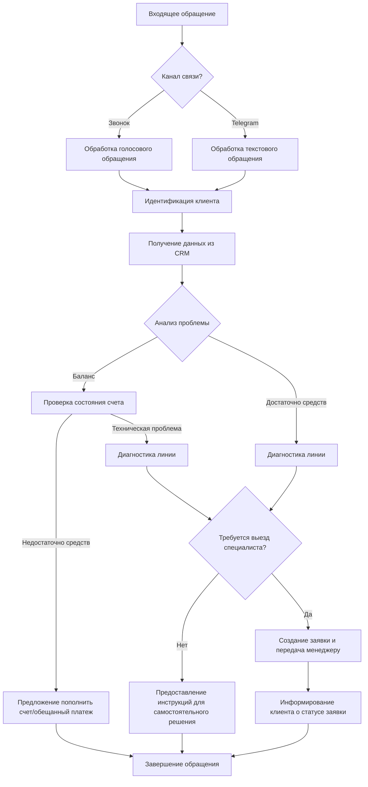

# Описание проекта нейро-технической поддержки для Гиганет

## 1. Общая информация о проекте

- **Название**: Интеллектуальная система технической поддержки с использованием технологий ИИ
- **Проблема**: Высокая нагрузка на существующую службу поддержки (до 250-300 звонков при авариях)
- **Решение**: Автоматизированная система обработки обращений клиентов с использованием технологий ИИ
- **Стратегическая ценность**: Повышение эффективности работы технической поддержки, сокращение времени ожидания, улучшение клиентского опыта
- **Сроки реализации**: 3-4 месяца
- **Бюджет**: 1 млн руб.

## 2. Бизнес-цели и измеримые показатели

- **Основные цели**:
  - Сокращение времени ожидания клиентов
  - Уменьшение количества пропущенных обращений
  - Автоматизация рутинных задач для операторов
  - Улучшение качества клиентского сервиса
  - Создание дополнительного канала для продажи услуг
  - Многоязычная поддержка

- **Измеримые показатели**:
  - Снижение среднего времени ожидания ответа на 30-40%
  - Увеличение количества обрабатываемых обращений на 50% без увеличения штата
  - Сокращение количества пропущенных звонков на 70%
  - Повышение уровня удовлетворенности клиентов на 10-30%
  - Увеличение конверсии дополнительных услуг на 15%

## 3. Детальные бизнес-процессы

### Схема основного процесса обработки обращений

### Основные этапы обработки обращений:
1. Прием входящего обращения (звонок/Telegram)
2. Идентификация клиента
3. Получение данных из CRM
4. Анализ проблемы (финансовый вопрос или техническая проблема)
5. Проверка баланса и/или диагностика линии
6. Предложение решения или создание заявки
7. Информирование клиента о статусе или решении
8. Суммаризация и структурирование диалога для хранения

## 4. Пользовательские истории и сценарии использования

### Ключевые пользовательские истории:
- Как клиент, я хочу быстро узнать баланс счета, чтобы понять причину отсутствия интернета
- Как клиент, я хочу сообщить о неисправности и получить оценку времени её устранения
- Как клиент, я хочу получить инструкции по самостоятельному решению проблемы
- Как оператор, я хочу видеть историю обращений клиента
- Как оператор, я хочу иметь возможность подключиться к диалогу в сложных случаях

### Основные сценарии:
1. **Проверка баланса и пополнение счета**:
   - Идентификация клиента
   - Проверка баланса
   - Предложение вариантов пополнения при недостаточном балансе
   - Подтверждение операции и восстановление услуги

2. **Диагностика и решение технической проблемы**:
   - Идентификация клиента
   - Проверка баланса и состояния линии
   - Создание заявки при обнаружении проблемы
   - Информирование о сроках устранения
   - Передача заявки менеджеру

## 5. Ограничения, допущения и риски проекта

### Ограничения:
- Использование существующей серверной инфраструктуры
- Интеграция с телефонией Oktell (коробочная версия)
- Формат обмена данными с CRM: JSON
- Ограниченное количество операторов (около 10 человек)
- Существующая база знаний ограничена 7 страницами
- Необходимость обезличивания персональных данных

### Допущения:
- Система будет обрабатывать до 70% типовых обращений без участия оператора
- Сохранение записей разговоров на серверах заказчика
- Возможность использования виртуальной машины на серверах заказчика

### Ключевые риски:
- Недостаточное качество распознавания и обработки обращений
- Негативная реакция клиентов на общение с ИИ
- Сопротивление со стороны персонала
- Технические сбои при интеграции с существующими системами
- Непредвиденные сценарии обращений, не учтенные при обучении

## 6. Критерии успеха и KPI

### Измеримые критерии успеха:
- Не менее 50% обращений обрабатываются без участия оператора
- Значительное снижение среднего времени ожидания ответа
- Доля пропущенных звонков не превышает 5% даже в пиковые периоды
- Рост показателя удовлетворенности клиентов на 15% и более

### Ключевые KPI:
- Процент автоматически обработанных обращений
- Среднее время решения типовых проблем
- Количество повторных обращений по одной проблеме
- Уровень удовлетворенности клиентов
- Количество успешно предложенных дополнительных услуг

## 7. Необходимые интеграции и требования к API

### Интеграции:
- CRM система компании Гиганет
- Телефония Oktell
- Система учета заявок
- База знаний технической поддержки
- Telegram API

### Требования к API:
- API для получения информации о клиенте из CRM
- API для создания и отслеживания заявок
- API для проверки состояния счета и баланса
- API для оформления обещанных платежей
- API для записи аудио и текста обращений
- API для транскрибации аудиозаписей и суммаризации диалогов
- Формат данных: JSON
- Структурированный формат для суммаризированных диалогов

## 8. Глоссарий ключевых терминов

- **CRM** - система управления взаимоотношениями с клиентами
- **Лицевой счет** - уникальный идентификатор клиента в системе Гиганет
- **Обещанный платеж** - временное предоставление услуг при отрицательном балансе с обязательством оплаты
- **Oktell** - система телефонии, используемая компанией Гиганет
- **LLM** - Large Language Model, большая языковая модель
- **Транскрибация** - преобразование аудиозаписи разговора в текстовый формат
- **Суммаризация** - автоматическое создание краткого содержания разговора
- **API** - интерфейс программирования приложений
- **База знаний** - структурированная информация о типовых проблемах и их решениях
